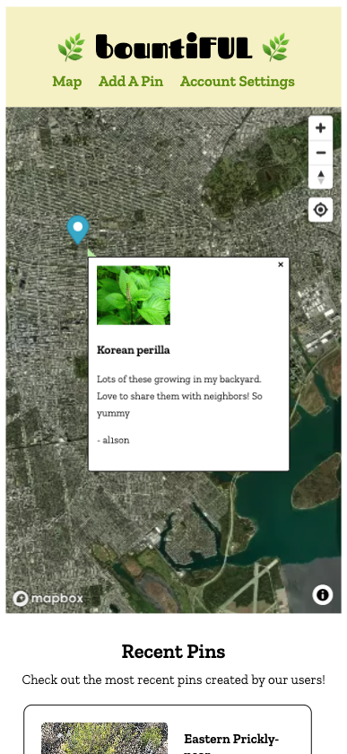

# Phase 5 Final Project: bountiFUL

## About
A mobile-first React site for foraging enthusiasts to see and track all different kinds of fruits, herbs, mushrooms, and the like.

## To Run:
- Fork and clone the repo
- cd into the project directory
- split the terminal into 2 windows
- in one terminal: run pipenv install & pipenv shell 
    - in this terminal, then cd into server
    - run python app.py to start up the server
- in another terminal: run npm install 
    - in this terminal, then cd into client
    - run npm start to start up the React front-end
    - this should open up a new browser window with the project

### Technology
* JavaScript
* React
* MapBox API
* Plant.id API